# Windows-Server-Homelab
Das Homelab dient als Testumgebung, um praktische Erfahrungen mit Active Directory und dem Gruppenrichtlinienverwaltungs-Editor zu sammeln. Hierbei wird das AGDLP-Prinzip zur Vergabe von Berechtigungen in Active Directory erprobt. Zudem werden verschiedene Gruppenrichtlinien (GPOs) erstellt und deren Auswirkungen auf Benutzer getestet.

Voraussetzungen
 - Virtuelle Maschine mit Windows Server
 - Active Directory Domain Services (AD DS) installiert
 - Virtuelle Maschine mit Windows Client, der der Domäne beigetreten ist
 - Netzwerkverbindung zwischen Server und Client

## Umsetzung des AGDLP-Prinzips im Active-Directory

Die Active-Directory-Struktur wurde mithilfe von Organisationseinheiten (OUs) aufgebaut. Zunächst wird nach Standort unterteilt. Innerhalb des Standorts befinden sich die Bereiche Benutzer, Computer und Gruppen.
    
    Standort
    ├── Benutzer
    │   ├── Abteilung 1
    │   ├── Abteilung 2
    │   ├── Abteilung 3
    │   └── Abteilung 4
    ├── Computer
    └── Gruppen
        ├── Global
        └── Lokal

Die Benutzer werden anhand ihrer Abteilung organisiert. Die Gruppen werden getrennt nach lokalen und domänenweiten Gruppen verwaltet, um das AGDLP-Prinzip umzusetzen. Hierbei gibt es für den Standort München vier globale Sicherheitsgruppen, jeweils eine pro Abteilung:

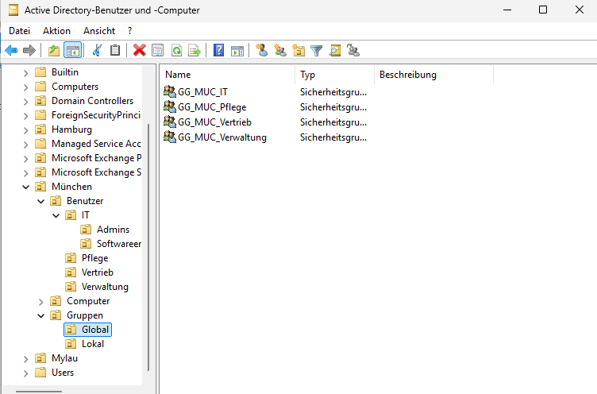
 

Diesen Gruppen werden die jeweils zugehörigen Benutzer der entsprechenden Abteilung zugeordnet. Dadurch wird sichergestellt, dass Benutzer nur über ihre Gruppenzugehörigkeit die für ihre Abteilung vorgesehenen Berechtigungen erhalten: 

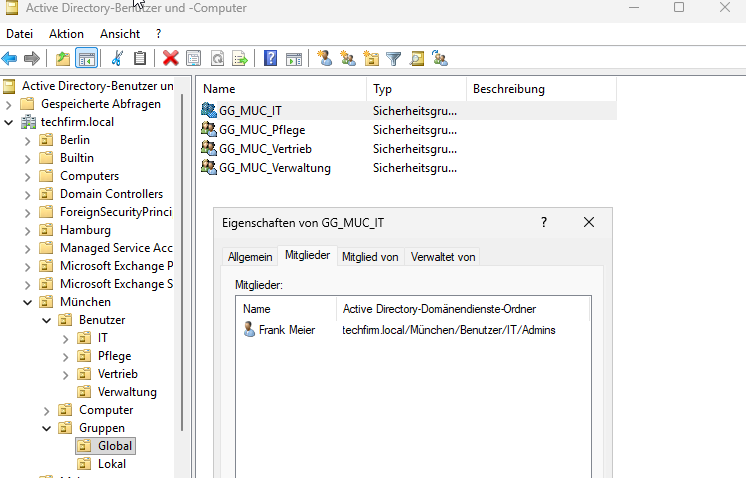
 

Die globalen Gruppen werden anschließend den entsprechenden domänenlokalen Gruppen zugeordnet, welche die benötigten Berechtigungen auf Ressourcen erhalten:

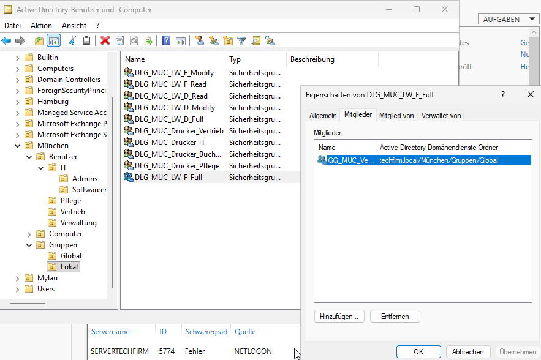

Als konkretes Beispiel:
`Benutzer → GG__MUC_Vertrieb → DLG_MUC_Drucker_Vertrieb → Freigabeberechtigung`

Durch die Anwendung des AGDLP-Prinzips werden Berechtigungen nicht direkt einzelnen Benutzern, sondern den entsprechenden Gruppen zugewiesen. Somit wird die Verwaltung von Berechtigungen übersichtlicher und erleichtert die spätere Anpassung.

## Erstellen von Gruppenrichtlinien im Gruppenrichtlinienverwaltungs-Editor
### Kennwortrichtlinie 
Diese Richtlinie soll die Sicherheit der Benutzerkonten erhöhen, indem Mindestanforderungen an Kennwörter festgelegt und die Wiederverwendung alter Kennwörter eingeschränkt wird. Dadurch werden einfache, kurze und häufig wiederverwendete Kennwörter verhindert.

Im Gruppenrichtlinienverwaltungs-Editor eine neue GPO erstellen und bearbeiten.
Zu dem folgendem Pfad navigieren:
`Computerkonfiguration → Richtlinien → Windows-Einstellungen → Sicherheitseinstellungen → Kontorichtlinien → Kennwortrichtlinien` 

Anschließend die folgenden Einstellungen festlegen: 

- Kennwort muss Komplexitätsanforderungen entsprechen: Aktivieren, um einfache Kennwörter zu verhindern (z. B. Kombination aus Groß-/Kleinbuchstaben, Zahl, Symbol).
- Kennwortchronik erzwingen: Aktivieren und auf 5 setzen, dadurch dürfen die letzten 5 verwendeten Kennwörter nicht erneut verwendet werden.
- Maximales Kennwortalter: 90 Tage
- Minimale Kennwortlänge: 12 Zeichen
- Minimales Kennwortalter: 30 Tage

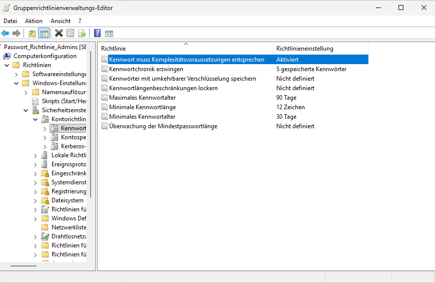
 

Die GPO noch entsprechend zuweisen.

Test:
- Testbenutzer anlegen und „Benutzer muss Kennwort bei der nächsten Anmeldung ändern“ aktivieren.
- Am Client mit dem Testbenutzer anmelden und bei der Kennwortänderung 12345 als neues Kennwort festlegen. 
- Die Anmeldung wird aufgrund der Komplexitätsanforderungen abgelehnt.
- Anschließend ein gültiges Kennwort setzen und die Anmeldung erfolgreich durchführen.

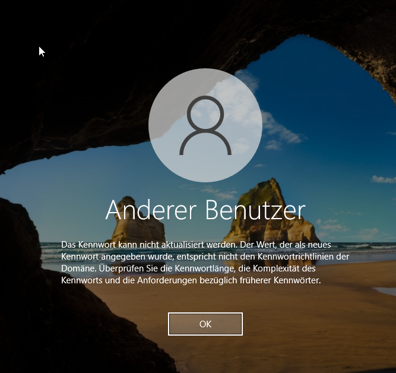

### Kontosperrungsrichtlinie
Diese Richtlinie soll vor Brute-Force-Angriffen schützen, indem nach mehreren fehlgeschlagenen Anmeldeversuchen das Benutzerkonto vorübergehend gesperrt wird.

Im Gruppenrichtlinienverwaltungs-Editor eine neue GPO erstellen und bearbeiten.
Zu dem folgendem Pfad navigieren:
`Computerkonfigurationen → Richtlinien → Windows-Einstellungen → Sicherheitseinstellungen → Kontosperrungsrichtlinie` 

Anschließend die folgenden Einstellungen festlegen: 
- Kontosperrungsschwelle: 3 ungültige Anmeldeversuche
- Kontosperrdauer: 30 Minuten
- Zurücksetzungsdauer des Kontosperrungszählers: 30 Minuten

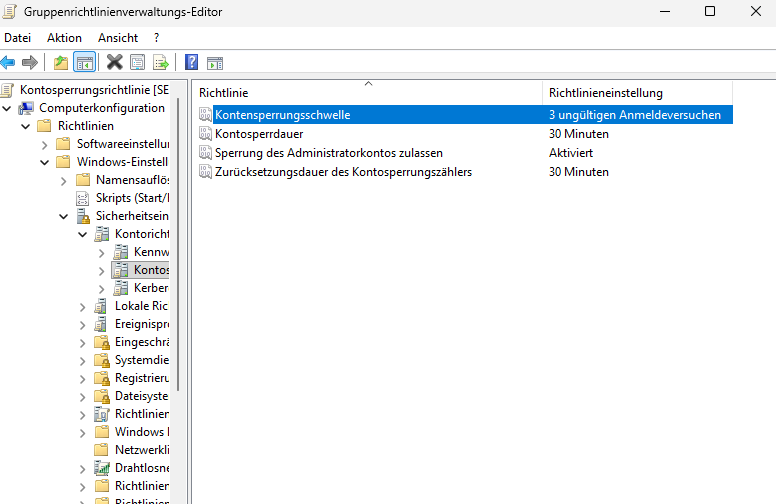
 

Die GPO noch entsprechend zuweisen.

Test:
- Am Client mit einem Testbenutzer anmelden und dreimal ein falsches Passwort eingeben.
- Anschließend Meldung, dass das Konto vorübergehend gesperrt ist.

 

### Laufwerkfreigabe
Diese Richtlinie soll die Zuweisung eines Laufwerks auf eine bestimmte Personengruppe festlegen.

Dazu im Explorer auf dem Server zu dem entsprechenden Laufwerk navigieren und die entsprechenden Freigabeberechtigungen für die jeweiligen domänenlokalen Sicherheitsgruppen definieren:

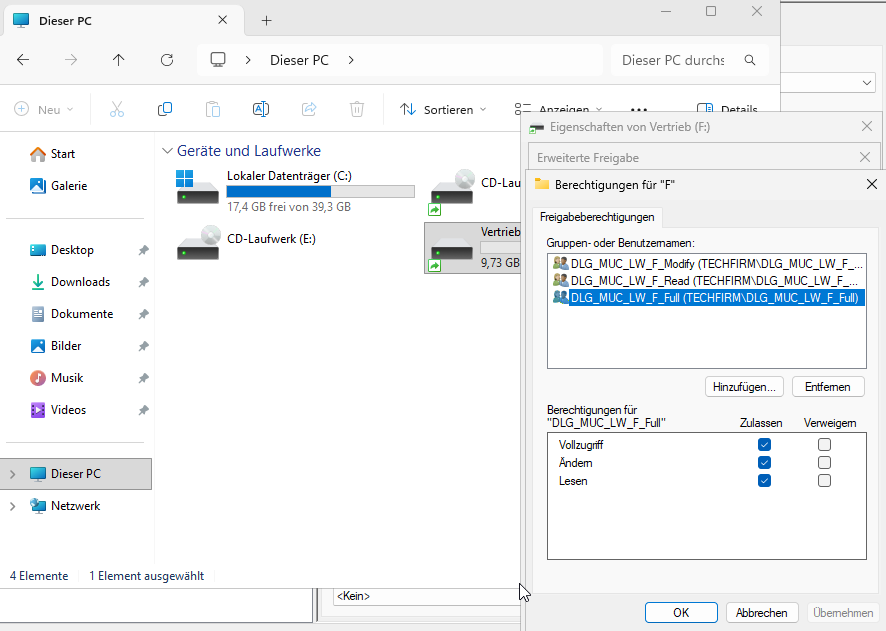
 

Im Gruppenrichtlinienverwaltungs-Editor eine neue GPO erstellen und bearbeiten.
Zu dem folgendem Pfad navigieren:
`Benutzerkonfigurationen → Einstellungen → Windows-Einstellungen → Laufwerkzuordnungen` 

Anschließend die folgenden Einstellungen unter 'Allgemein' festlegen: 

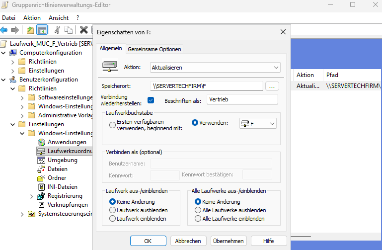
 

Unter gemeinsame Optionen den Haken bei `Zielgruppenadressierung auf Elementebene` setzen und bei `Zielgruppenadressierung...` die globale Sicherheitsgruppe hinzufügen: 

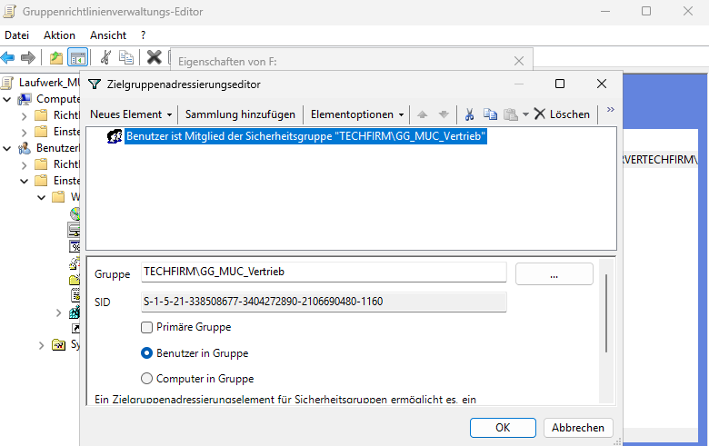
 

Die GPO noch entsprechend zuweisen.

Test:
- Am Client mit einem Testbenutzer aus dem Vertrieb anmelden und im Explorer prüfen, ob Laufwerk `F` angezeigt wird:

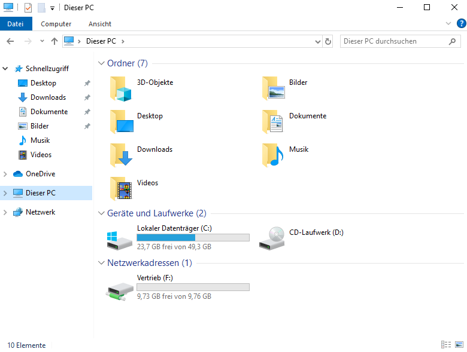
 

- Am Client mit einem Testbenutzer aus einer anderen Abteilung anmelden und im Explorer prüfen, ob das Laufwerk `F` nicht angezeigt wird.
 

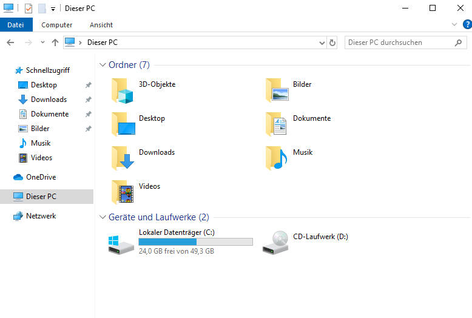
 

### Lokale Anmeldung am Server und per RDP nur für IT-Abteilung erlauben
Diese Richtlinie legt fest, welche Benutzergruppen sich lokal oder per Remote Desktop (RDP) am Server anmelden dürfen. 

Für die Aktivierung von RDP zuerst im Gruppenrichtlinienverwaltungs-Editor eine neue GPO erstellen und bearbeiten.
Zu dem folgendem Pfad navigieren:
`Computerkonfiguration → Richtlinien → Administrative Vorlagen → Windows-Komponenten → Remotedesktopdienste → Remotedesktopsitzungshost → Verbindungen` 

Anschließend die folgende Richtlinie aktivieren: 

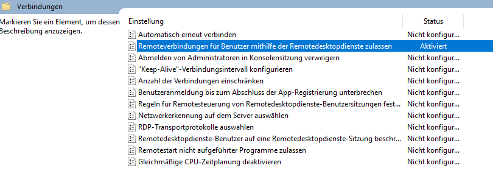
 

Außerdem muss eine eingehende Firewallregel erstellt werden, deshalb zu dem folgendem Pfad navigieren:
`Computerkonfiguration → Richtlinien → Windows-Einstellungen → Sicherheitseinstellungen → Windows Defender Firewall mit erweiterter Sicherheit → Eingehende Regeln` 

Eine neue eingehende Regel erstellen mit TCP und Port 3389:

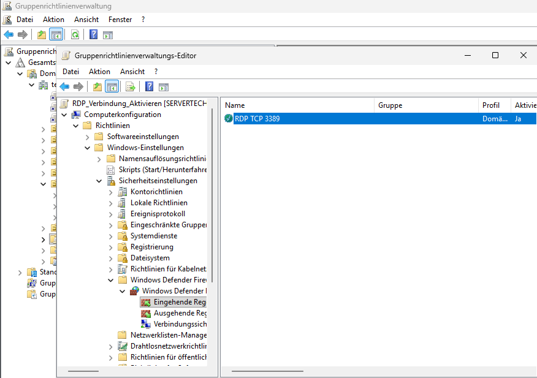
 

Die GPO entsprechend zuweisen.

Zusätzlich zu dieser muss eine GPO erstellt werden, in der definiert wird, welche Benutzergruppen sich lokal oder über Remotedesktopdienste am Server anmelden dürfen.

Hierzu wird zu folgendem Pfad navigiert:
`Computerkonfiguration → Richtlinien → Windows-Einstellungen → Sicherheitseinstellungen → Lokale Richtlinien → Zuweisen von Benutzerrechten`

Anschließend werden folgende Richtlinien angepasst:
- Anmelden über Remotedesktopdienste zulassen → IT-Sicherheitsgruppe (z. B. GG_IT) wird hinzugefügt, damit nur autorisierte Benutzer per RDP auf den Server zugreifen können
- Lokales Anmelden zulassen → Die Berechtigung wird ebenfalls auf die gewünschten Benutzergruppen beschränkt
  

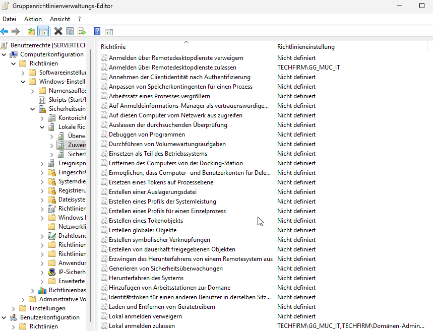
 

Test:
- Am Server mit einem Testbenutzer anmelden, der nicht in der IT-Abteilung ist, und prüfen, ob eine lokale Anmeldung möglich ist.
  

 

- Am Client mit einem Testbenutzer anmelden, der in der IT-Abteilung ist, und prüfen, ob sich dieser per RDP mit dem Server verbinden kann.

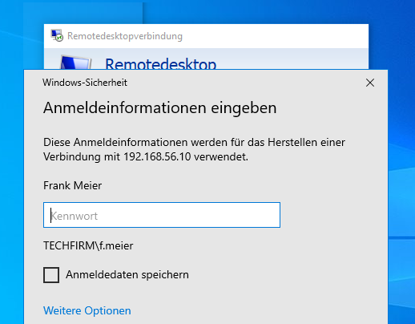
 

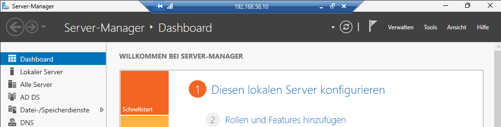
 

- Am Client mit einem Testbenutzer anmelden, der nicht in der IT-Abteilung ist, und prüfen, ob sich dieser per RDP mit dem Server verbinden kann.

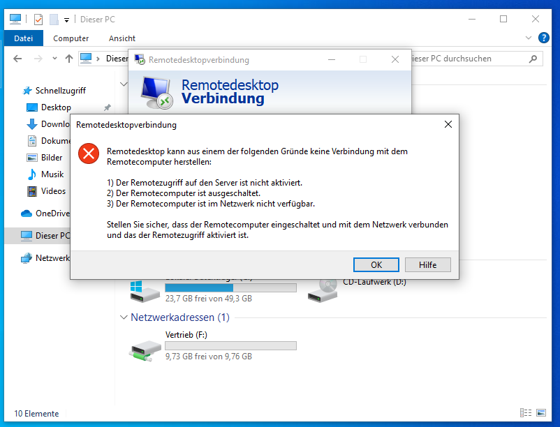

